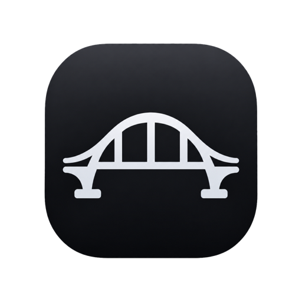
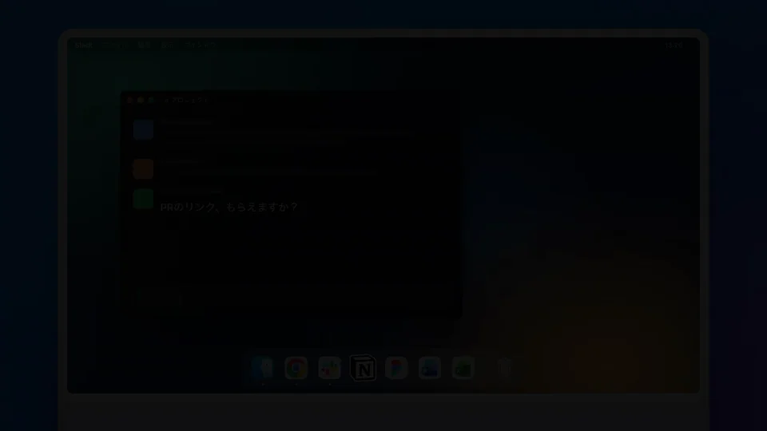
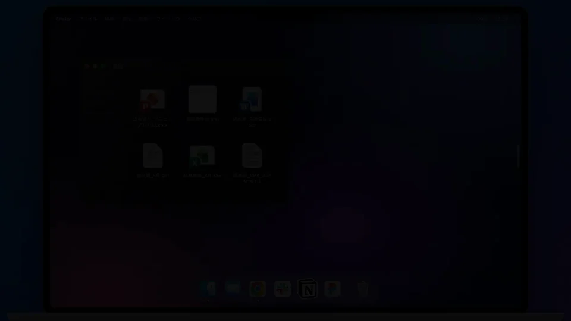

<div align="center">



# Bridge

**Copy on one device. Paste on all of them.**

A small desktop app that lives at the edge of your screen and syncs your files<br>
and clipboard history across Macs and Windows PCs on the same LAN.

[](#requirements)
[](#license)

[**Download**](https://github.com/haruhito767676/bridge/releases) · [日本語](README.ja.md)

</div>

<br>

https://github.com/user-attachments/assets/4f4bfa27-27af-47ce-b0db-c9b4410e2dde

<p align="center"><sub>Demo video (46 seconds)</sub></p>

> **Note:** The app UI and the demo videos are currently in Japanese. An English UI is planned.

---

## What Bridge does

### Copy once, and it's everywhere

<p align="center"></p>

Text, images and files you copy on your Mac show up in the history of your iMac and Windows PC on the same LAN. Click an item to paste it. Devices talk to each other directly, so nothing is uploaded to a cloud. A badge on each item tells you which device it came from.

### Paste from your history, right where you are — ⌥⌘V

<p align="center"></p>

**Quick Paste** opens a small history popup next to your cursor. Type to filter, press Enter, and the item is pasted on the spot (**Ctrl+Alt+Shift+V** on Windows).

### Files, just as they are

<p align="center"></p>

Drop files from Finder or Explorer onto the handle at the screen edge and they wait on the shelf. Drag them out into any other app later. Folders are sent as a zip and unpacked automatically on the receiving device.

### Delivered to you, and only you

<p align="center"></p>

Sync traffic is encrypted with **AES-256-GCM**, using a key derived from your sync key (both metadata and file contents). The sync key itself is never sent over the network: each request carries only a keyed proof (an HMAC with a timestamp and a one-time nonce), and replays are rejected. Requests from anyone without the matching key are rejected. Bridge does not authenticate peers with certificates, so it is meant for use on a LAN you trust. (Version 1.x sent the sync key in a request header; this was fixed in 2.0.0, which cannot sync with 1.x.)

---

## Getting started

1. Download the macOS DMG or the Windows installer from **[Releases](https://github.com/haruhito767676/bridge/releases)** and launch it. A thin handle appears at the right edge of your screen.
2. **To sync**, open the settings sheet from the gear icon at the bottom right of the panel and press "Copy" next to the sync key. Send it to your other device by any means (a chat to yourself, email, and so on), copy it there, and press "Paste" next to the sync key in its settings sheet. Devices that share the key find each other automatically on the same LAN, and the status card at the top of the settings sheet changes to "Connected to 1 device".
3. Just copy things as usual. Hover over the handle, or press **⌥Space** (**Ctrl+Shift+Space** on Windows), to open the history panel.

> The current builds are not notarized by Apple. If macOS shows a warning on first launch, open System Settings → Privacy & Security and choose "Open Anyway" (on macOS 14 or earlier, right-clicking the app and choosing "Open" also works).

---

## Feature details

<details>
<summary>File shelf / Clipboard history / Automatic device sync / Search / Keyboard</summary>

#### 1. File shelf
- Drag and drop files from Finder / Explorer to keep them temporarily
- Drop an image or link from a browser and Bridge downloads it and saves it as a file
- Drop selected text and it is saved as `snippet_*.txt`
- Drag items out of the list to drop them into other apps as files (multiple selection, rectangle selection, Shift / ⌘ click supported)
- Click an item to copy the file itself to the clipboard (macOS: `public.file-url` / Windows: `CF_HDROP`), then paste it into Finder / Explorer / chat apps with ⌘V / Ctrl+V
- Press Space to open macOS Quick Look

#### 2. Clipboard history
- Watches the clipboard every 500 ms and adds text, images and files to the history
- For text, both the original string and an auto-generated `.txt` file are kept. Click to copy the string, or drag to take it out as a `.txt` file
- Copied images are converted to PNG and shown as thumbnails
- Files copied in Finder / Explorer are detected and added too
- Copying the same content again moves the existing item to the top instead of adding a new one. Clicking an item in the list to copy it does the same, and updates its time
- History limits are per kind (100 text / 30 images / 100 files). Older items beyond the limit are deleted, and files Bridge generated are also removed from disk. The current counts appear on the "Advanced settings" page of the settings sheet, for example "Text 82/100 · Images 12/30 · Files 40/100" (pinned items are not counted)
- Copies flagged as "do not keep in history" (Concealed / Transient) by password managers and similar tools are neither recorded nor synced
- The history is saved in `history.json` and survives restarts. Pin frequently used items (right-click / ⌘P) to keep them at the top, exempt from limit-based deletion and "Clear all"
- Press **⌥⌘V** (Windows: Ctrl+Alt+Shift+V; configurable in the settings sheet) to open **Quick Paste**, a history popup near the mouse cursor, and paste the chosen item on the spot. Auto-paste (the "Auto-paste in Quick Paste" switch in the settings sheet) can be turned off. On macOS this needs the Accessibility permission

#### 3. Automatic sync between devices
- Each device runs an HTTP server (`node:http`) on port `9095`, and devices talk to each other directly
- Devices that share the same sync key are discovered automatically over UDP multicast. If that fails, use "Scan now" on the status card at the top of the settings sheet (scans the same /24 subnet) or write the peer's IP address into `sync-config.json`
- New items are sent to peers as soon as they are added. Anything that fails to send is picked up later by a 20-second differential check (timestamp comparison)
- With three or more devices, items are relayed through intermediate devices to reach ones that are not directly connected
- Authentication uses the shared sync key. Any request with a mismatched key is rejected with 401 (compared with `timingSafeEqual`)
- "Clipboard watching" and "Sync with other devices" can each be paused from the menu bar. The status card at the top of the settings sheet shows whether you are connected. The last sync time and failure reasons for each device are listed under "Connected devices" on the "Advanced settings" page, and the activity log is written to `bridge.log`
- Folders are compressed to `.zip` for sending. The receiving side unpacks them back into folders automatically if they are 1 GB or smaller. Larger ones arrive as a zip and can be unpacked from the right-click menu ("Extract as folder")
- Items being received from another device appear in the list as "Syncing" before the file body arrives, and are replaced with normal items when done. Order and time follow the time the item was added on the sending side
- While a large file is being received, progress (%, size received, speed) is shown. If nothing moves for a while, "May be stalled" appears with a retry button. You can cancel anytime with ×
- Transfer progress also appears in the menu bar (macOS: `↓42%` next to the icon; Windows: "Transferring 42%" in the tray tooltip; "N transfers" when several run at once)
- Items that arrive from other devices show the sender's device name and device type (laptop / desktop) icon
- Right-click "Show only this device's items" / "Show only items from …" to filter by device. While filtering, a label appears under the kind switcher; clear it with ✕ or Esc

#### 4. Search
- The search field is focused as soon as the panel opens
- The "All / Files / Clips" buttons under the search field filter by kind and combine with keyword search
- With focus in the search field, use ↑↓ to choose a result and Enter to copy (the same as Spotlight)
- During keyword search, the footer shows the hit count (not shown when only filtering by kind)

#### 5. Keyboard and menus
- ↑↓ = move between rows, Enter = copy, ⌘Enter = reveal in Finder, Space = Quick Look, ⌫ = remove from the list, Esc = close
- Right-click menu: Copy / Open link / Quick Look / Reveal in Finder / Open / Copy path / Pin / Remove from list. For a URL text, ⌘Enter opens it in the browser
- Items whose original file was moved or deleted show "Not found". Right after dragging something out, "Undo" puts it back in the list
- Menu bar icon: click to show / hide the panel. Right-click for "Pause watching", "Pause sync", "Launch at login", "Settings…", "Check for updates…", "Quit Bridge". Update checks can also be run from the settings sheet
- Shortcuts (show / hide the panel, Quick Paste) can be changed in the settings sheet: click the field and press the keys you want (must include Ctrl / Alt / ⌘). Use this if they clash with another app's shortcuts
- On Windows, the handle is not shown while a video or game is in full screen

</details>

## Requirements

| Item | Details |
|---|---|
| Platforms | macOS / Windows (no guarantees on Linux). The look follows each OS: macOS uses a translucent blurred background; Windows uses a Fluent-style flyout |
| Runtime | Electron 43.x / Node.js (bundled with Electron) |
| Dependencies | None (devDependencies are only electron / electron-builder) |

## Usage

1. On launch, a 15 px handle appears at the middle of the right edge of the display where the mouse cursor is. An icon also appears in the menu bar (not in the Dock).
2. The 320 px panel opens from the right edge in any of these ways. With multiple displays, the right edge of any display responds.
   - Hover over the handle for about 0.25 seconds
   - Drag a file near the handle
   - Press **⌥Space** (Windows: Ctrl+Shift+Space)
3. Drop a file / image / text to add it to the list. Click an item to copy it; a checkmark appears and the panel closes automatically, so you can paste right away with ⌘V. Drag an item to take it out into another app.
4. The panel closes automatically when the mouse leaves it. When opened with the mouse, Bridge does not steal keyboard focus from the app you are working in (only opening with the hotkey focuses the search field).

### `bridge://` URL scheme

Other apps (such as macOS Quick Actions) can add items.

```
bridge://add?path=/absolute/path/to/file    # Add a local file (the panel asks for confirmation; press "Add")
bridge://add?text=https://example.com/x.png # URL → download and add
bridge://add?text=any text                  # Text → saved as .txt and added
```

## Sync settings

Open the **settings sheet** from the gear icon at the bottom right of the panel. The first page has the connection status, device name, sync key, shortcuts, Quick Paste auto-paste, the source-app icon and launch at login. Auto scan, manual peers, the connected devices list, history usage and the log are on the "Advanced settings" page. Changes are saved automatically.

To sync, use the same sync key on every device. Press "Copy" for the sync key in the settings sheet on the first device, move it to the other device by any means outside Bridge, and press "Paste" in the settings sheet there. Bridge does not carry the key for you, because nothing is shared between the devices until they have the same key. Connected devices are shown on the status card, under "Connected devices" on the "Advanced settings" page, and by the green dot in the footer.

Settings are stored in `sync-config.json`, created in the `userData` directory on first launch. To change `port`, edit this file directly and restart the app.

- macOS: `~/Library/Application Support/bridge/sync-config.json`
- Windows: `%APPDATA%\bridge\sync-config.json`

```json
{
  "port": 9095,
  "peers": ["192.168.1.23", "192.168.1.40:9095"],
  "autoScan": true,
  "myDeviceName": "Win-Desk",
  "secretToken": "a shared key, the same on every device"
}
```

| Key | Description |
|---|---|
| `port` | Port the sync server listens on (default `9095`) |
| `peers` | Peers to connect to manually (`host` or `host:port`). For devices that auto-discovery cannot find, or that are on another network segment |
| `autoScan` | Automatic discovery over UDP multicast (default `true`). If no peer is found 15 seconds after launch, a /24 subnet scan runs once |
| `autoPaste` | Paste automatically after choosing an item in Quick Paste (default `true`) |
| `showSourceApp` | Show the source app's icon on items (macOS default `true` / Windows default `false`, because Windows launches PowerShell on every copy) |
| `myDeviceName` | Your device name as shown on other devices (defaults to `os.hostname()`) |
| `secretToken` | **The sync key. Use the same value on every device that syncs (the same as "Sync key" in the settings sheet).** If unset, a random one is generated on first launch |

Requests from peers with a mismatched sync key are always rejected with 401. So even if someone else's Bridge is on the same LAN, your histories are never mixed or visible to them.

## Development

<details>
<summary>Setup / Build / Environment variables for development</summary>

```bash
npm install
npm start          # run in development
```

These environment variables help with visual checks and work only in development (disabled in packaged builds).

```bash
BRIDGE_DEV_SEED=1 npm start          # Fill in dummy items, keep the panel open, and print the window bounds to stdout
BRIDGE_DEV_SEED=settings npm start   # Same as above, and also open the settings sheet
BRIDGE_DEV_SHOT=/tmp/page.png ...    # Save the Renderer's content as a PNG
BRIDGE_DEV_EVAL='...' ...            # Run JS in the Renderer after the panel opens
```

> **Note on launching on Windows**: The GUI does not start from a shell where the environment variable `ELECTRON_RUN_AS_NODE` is set. Unset it before `npm start`. Also, only one Bridge can run at a time; a second one exits immediately.

#### Build

```bash
npm test             # Tests for pure functions (node --test, no dependencies)
npm run build        # For the current OS (Windows: NSIS / Linux: AppImage)
npm run build:mac    # DMG for macOS
```

The macOS build enables the Hardened Runtime. With the current settings (`mac.notarize` in `package.json`), Apple notarization is not performed.

Artifacts are written to `dist/`.

</details>

## Project structure

```
bridge/
├── main.js               # Main process: window management, clipboard watching, sync server
├── preload.js            # IPC API exposed to the Renderer through contextBridge (window.bridge.*)
├── renderer.js           # Renderer: list UI, search, selection, drag & drop, history
├── index.html            # Panel HTML (with CSP)
├── styles.css            # Design tokens and panel styles (light / dark)
├── popup.html / popup.js / popup.css  # Quick Paste popup
├── tab.html / tab.js / tab.css        # Windows: per-display handle windows
├── lib/format.js         # Pure functions for display (shared by Renderer and tests)
├── lib/sync-utils.js     # Pure functions for sync / detection (shared by Main and tests)
├── test/                 # node --test tests
├── scripts/start.js      # Dev launcher (removes ELECTRON_RUN_AS_NODE and starts electron)
└── package.json          # electron-builder config (including bridge:// scheme registration)
```

For architecture, the communication protocol and the IPC API, see **[SPEC.md](SPEC.md)** (Japanese).

## Design notes

- **Security**: `contextIsolation: true` / `nodeIntegration: false`. The Renderer uses only the minimal API exposed by `preload.js`. CSP forbids loading external resources.
- **Disk cleanup**: Files Bridge generates (`clipboard_*.png` / `snippet_*.txt` / `text_*.txt` / files received through sync / zips it creates) are tracked in `sessionTempFiles` and deleted when history limits are exceeded and on exit. **Original files the user dropped are never deleted.** The `*` in file names is a timestamp such as `2026-09-15_14-30-05` (hyphen-separated, because colons are not allowed on Windows).
- **Recovery from failures**: If the Renderer crashes it reloads automatically. Items that arrive before the Renderer is ready are queued. If a file transfer fails during sync, the timestamp is not advanced, so the next differential check retries.
- **Memory use**: File transfers in sync are streamed in both directions, so even multi-GB files don't use much memory.

## Known limitations

- On Windows, a PowerShell process started at launch is used to detect copied files, write files to the clipboard, and auto-paste. Where PowerShell cannot run, copy detection is limited to the first file only and auto-paste is unavailable.
- Finder's "Kind" display (`mdls`) and Quick Look are macOS only. On other OSes the kind is shown from the file extension.
- Sync requests are authenticated with an HMAC-SHA256 proof derived from `secretToken` (header `x-bridge-auth`; the key itself is never sent), and the traffic is encrypted with AES-256-GCM using a separate key derived from `secretToken` (both metadata and file contents). Peers are not authenticated with certificates, though. The goal is to prevent eavesdropping and tampering on a LAN, and Bridge assumes use on a LAN you trust.

## License

MIT © haruhito767676
